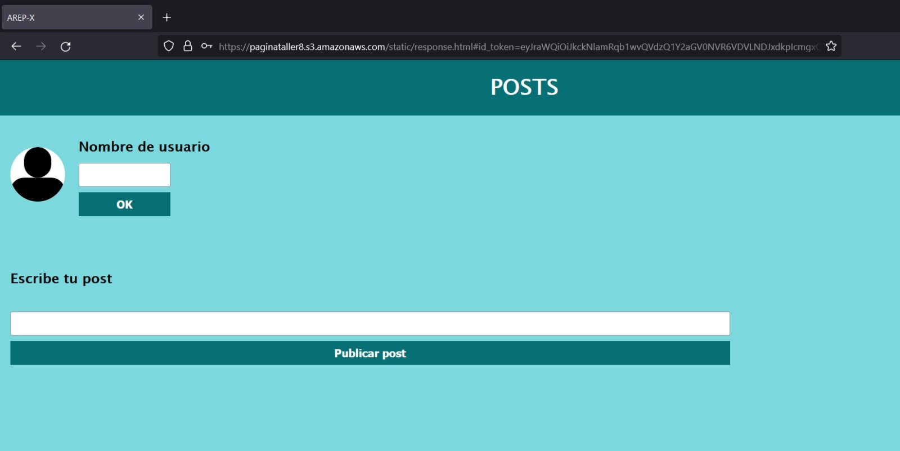

# Taller 8 - Microservicios

Se diseño una aplicación con Quarkus manejando tres entidades que permitirán simular el comportamiento de Twitter. Las entidades trabajadas son usuario, hilo y post. Además, se diseño un JS para poder usar el servicio y poder tener una interfaz para la aplicación. Por otro lado, estos archivos estaáticos fueron desplegados usando el servicio s3 de AWS. Por ultimo, se implemento un inicio de sesión seguro con el servicio de AWS cognito.

## Prerrequisitos

- MAVEN
- JAVA
- GIT
- Docker

## Instalación

Para obtener el proyecto y poder ejecutarlo, debe clonarlo o descargarlo en formato ZIP.

```
git clone https://github.com/RicardoPR17/arep-taller8.git
```
Acceda al directorio del proyecto:

```
cd arep-taller8
```

Para compilar y ejecutar el proyecto, se ejecuta el comando:

```
./mvnw compile quarkus:dev
```

También es posible ejecutar este comando usando mvn, en vez de ./mvnw:

```
mvn quarkus:dev
```

> **_NOTA:_**  Es necesario tener corriendo un contenedor de mongodb en Docker. Para crear el conedor puede jecutar el siguiente comando:

```
docker run -d -p 27017:27017 --name mongodb mongo:latest
```

## Arquitectura

En el proyecto se manejaron tres carpetas, cada una relacionada con las entidades principales, que son: hilo, post y usuario. 

En cada carpeta estan las clases DAO y servicio, donde DAO es el controlador que gestiona las opraciones hacia la base de datos y el servicio es el que expone las rutas para manejar las peticiones.

- Entidad hilo: se puede obtener el unico hilo o se pueden añadir post al hilo.
- Entidad post: se puede crear un post, buscar los post de un usuario, listar todos los post y eliminar el post.
- Entidad usuario: se puede crear un usuario, cosultar un usuario, listar los usuarios y eliminar un usuario.

Para trabajar con la base de datos tenemos la clase MongoUtil, que nos permite establecer la conexión a esta. 

Se hizo la configuración para obtener los archivos estáticos que se crearon e StaticResources.

Se tomo de base la clase del taller individual, para tener la cofiguración para manejar un JWT.

## Pruebas en local

Para probar el funcionamiento de la aplicación, acceda a un navegador e ingrese la ruta: http://localhost:8080/static/response.html


En caso de no contar con un usuario existente, puedes hacer una petición en postman para crear un usuario:


Ingrese el nombre de usuario de un usuario existente y de clic en el boto ok, aquí se confirma el @ de la persona, con el cual van a quedar publicados los post:


Puede escribir un post en el formulario y dar clic en publicar post, podra verificar que la lista se post se actualiza y muestra el post enviado:


## Pruebas del S3

Para esto se subieron los archivos estaticos al servicio de S3 y se hicieron publicos:


Y se puede probar el acceso a los archivos estáticos con la siguiente url: https://paginataller8.s3.amazonaws.com/static/response.html

Y se puede ver la siguiente página:


## Pruebas de login con cognito de AWS

Primero se crea el servicio de cognito con sus respectivas configuraciones y una vez creado accedemos al servicio y creamos un usuario:


En caso de que ya se tenga una cuenta hacemos singin:


Y luego de que la autenticaión termine satisfactoriamente, nos redirige al servicio S3 configurado anteriormente:



Si observamos la URL, veremos un query llamado id_token que contiene el JWT asignado para el usuario.

Por su parte, en la consola de AWS se pueden ver los usuario creados y el estado de los mismos:


## Despliegue con Lambda

Dada la configuración del proyecto no fue posible generar el archivo jar, debido a problemas relacionados con Quarkus y sus dependencias. Por lo tanto no se pudo hacer el despliegue en este servicio para su posterior conexión con Cognito y los archivos en el S3.

## Construido con

- Maven para la gestion de dependencias.
- AWS para el despliegue.
- Git para el control de versiones.
- JAVA para el desarrollo.
- Docker para el manejo de contenedores.
- S3 para el almacenamiento de archivos.
- Cognito para la autenticación y autorización de usuarios.

## Autores:

- Jessica Daniela Muñoz Ossa
- Ricardo Pulido Renteria
- Laura Nathalia García Acuña 

